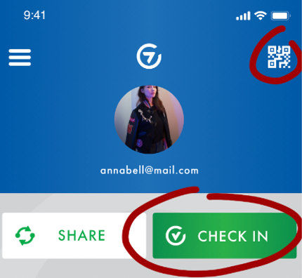

## Scan a QR code
A clubroom QR-code is connected to a Card4Action location which you can check into via the app. These will always feature a keyhole in the middle.

To scan a Clubroom QR-code, you click the green "**CHECK IN**" button on the app’s homepage, or by clicking the QR symbol at the screen’s top right corner.

The camera on your phone will then open. Aim the camera at the QR-code so that you can see it on the camera view.

> You need to give the app permission to use the camera function on your phone in order to scan QR-codes. See more details on this further down.

When the app has scanned the code, you choose which one of your cards you would like to use to check-in with (in case you have several).
You will then receive confirmation of the name of the location you have just checked into. Click "**CONTINUE**" to proceed.

You are now checked-in at this Clubroom.

 

### Check-in with a 6 digit code
In case scanning the QR-code has been unsuccessful, you can type in the 6 digit code to check-in. When the camera is running you can click "**FIND BY CODE**" at the bottom of the app screen and fill out the 6 digit code.

You can find the 6 digit code below the QR-code.

 

### Give permission to use the phone's camera
If the app does not have access to the camera on your phone, it will request this once you open the QR-scanner in the app.

A yellow notification will be displayed on the startpage of the app if the app lacks camera access. You can click this notification to be redirected to your phone’s settings to give the app permission to use your camera.