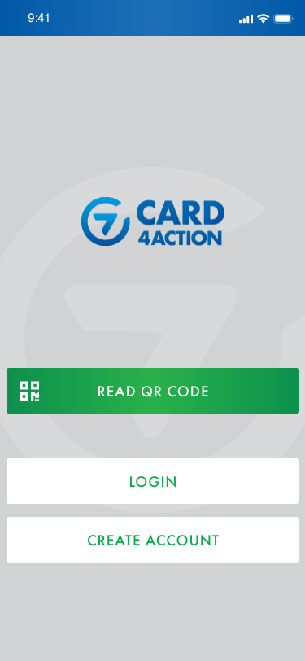

## Install the app
Download the app **Card4Action** from AppStore or Google Play.

> You can also scan a Card4Action QR-code with your mobile camera to get straight to AppStore/Google Play.  
> These QR-codes will always feature the symbol of a keyhole in the middle.

  

## Create an account
The first time you open the app you will be directed to the homepage which displays three different options/buttons:
* **READ QR-CODE**: Allows you to check-in somewhere annonymously (more info on this can be found further down in the document).
* **LOGIN**: Login with an existing Card4Action account.
* **CREATE ACCOUNT**: Create a new Card4Action account.

To set up a new account, you click on the "**CREATE ACCOUNT**" button.

Setting up a new account includes 3 steps:

1. Fill out your email address and choose a password. These are the details you will need to logon to the app again.
2. Write your name, surname, telephone number (optional), time-zone.
3. Accept the terms and conditions.

You will then be redirected to the startpage with your new account and are now ready to use Card4Action.

 

### Check-in Annonymously
You can also check-in to places with Card4Action without creating an account. You do this by clicking the "**READ QR CODE**" button on the app’s homepage before you logon or create an account.

> Please note that many of the app’s functions cannot be used whilst checking-in anonymously.